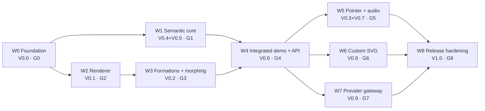

# AISAC Orbs — SPEC-driven implementation plan (waves)

## 1. Header

| Field             | Value                                                                                               |
| ----------------- | --------------------------------------------------------------------------------------------------- |
| **Status**        | approved for implementation (2026-09-14)                                                            |
| **Version**       | 1.2.0                                                                                               |
| **Implements**    | `SPEC.md` 0.1.0 → 0.2.0 via `specs/SPEC-amendments-proposal.md` (applied in Wave 0, slice 0.8)      |
| **Date**          | 2026-09-14                                                                                          |
| **Owner**         | maintainer                                                                                          |
| **Wave files**    | `specs/waves/wave-00-foundation.md` … `specs/waves/wave-08-release-hardening.md`                    |
| **Traceability**  | `specs/TRACEABILITY.md` (planning snapshot now; W0 introduces `scripts/req-coverage.ts`)            |
| **Shared naming** | Every wave file uses the type, module and folder names in §4 verbatim; a wave may add, never rename |

**Review status (2026-09-14):** planning review completed and the maintainer approved implementation. See [PLAN-REVIEW.md](PLAN-REVIEW.md) for the historical review, [SHARED-CONTRACTS.md](SHARED-CONTRACTS.md) for reconciled contracts, and [IMPLEMENTATION-STATUS.md](IMPLEMENTATION-STATUS.md) for current units and verified evidence. Approval does not mark any gate complete.

**Implementation amendment 1.2.0:** the approval baseline is plan 1.1.0. W0 review adds exact-package license approvals with preserved license text and attribution; general unknown-license rejection is retained. Requirement lock checks compare against a trusted base revision as well as generated current artifacts, and CI explicitly uses `--reports-only` after its test stages. These scoped implementation decisions are recorded in [dependency license review](../docs/reference/dependency-licenses.md) and W0 §4.5–4.6; no product requirement or wave ownership is weakened.

## 2. Purpose and how to use this plan

This plan turns `SPEC.md` (the normative source of truth, §28 rule 1) into nine shippable increments called **waves**. A wave is the unit of planning; a **gate** (G0…G8) is the objectively checkable condition under which a wave is done. Waves are not sprints: a wave closes when its gate is green, however long that takes.

- **A wave file is the spec for its pull requests.** Each `specs/waves/wave-0N-<slug>.md` lists the requirement IDs it owns, the vertical slices that satisfy them, TypeScript contracts, acceptance criteria (Given/When/Then, tagged with IDs and test files) and exit criteria. A PR that implements part of a wave links the slice it delivers and updates the wave file in the same PR (Docs as Code).
- **`SPEC.md` stays the normative truth.** Wave files add precision (contracts, defaults, edge cases) but never contradict a requirement. When a wave discovers that the spec is ambiguous or silent, the fix is a spec amendment with a new stable ID (§28 rule 3), delivered as a PR labelled `spec-change`, not a wave-local decision.
- **Co-evolution.** Wave 0 applies `specs/SPEC-amendments-proposal.md` (SPEC 0.1.0 → 0.2.0), which assigns IDs to every unnumbered normative clause and resolves ambiguity decisions A-01…A-18. Later spec changes bump the SPEC version, and every release records the SPEC version it implements (§28 rule 10, `OrbEngine.SPEC_VERSION`).
- **Ownership.** Every requirement ID is _owned_ by exactly one wave (fully satisfied and verified before that wave's gate). A wave may _touch_ an ID owned elsewhere and must say so. §11 is the ownership summary; `specs/TRACEABILITY.md` is the generated full matrix.
- **Reading order for a new contributor:** `SPEC.md` → this file §3–§6 → the wave file you are implementing → `specs/TRACEABILITY.md` for the tests that already cover your IDs.

## 3. Planning principles

1. **Spec-driven.** No normative behaviour without a stable ID; no ID without a test or a recorded manual verification; no weakening of a requirement to make an implementation pass (§28 rules 3, 5, 6). Provisional IDs live in `specs/requirements.overrides.yaml` until the spec PR lands.
2. **Modular monolith, vertical slices, bounded contexts.** SPEC §25 folders are the bounded-context roots (§4). Each slice crosses presentation → application → domain → infrastructure inside one root and ships independently. Dependencies point inward: `engine/render` implements `engine/ports`; `components/**` and `app/**` import only `engine/index.ts`, `adapters/index.ts`, `formations/index.ts`; `core` imports nothing. The rules are executable (`.dependency-cruiser.cjs`, Wave 0) and run in CI.
3. **Security mitigations land in the wave that creates the surface.** The STRIDE delta of each wave (§8.1) is closed inside that wave; a gate does not close with an open mitigation.
4. **Accessibility no later than the first visible state.** Wave 1 ships the HTML-only "text orb" (`components/a11y/*`) before any canvas renders in an integrated page; the WebGL layer is added to an already accessible UI, never the reverse (ORB-A11Y-001, ORB-A11Y-006).
5. **Provider secrets are server-side from the first provider touch.** The OpenAI adapter (Wave 7) exists only as `adapters/openai/server/**` imported by `app/api/**`; the browser adapter talks to the gateway over SSE. The bundle-secret scan (Wave 0) runs from day 0 so the rule is enforced before there is anything to leak (ORB-SEC-001, ORB-ADAPTER-003).
6. **Every MUST has a test.** Unit or integration for all; an additional E2E for user-observable MUSTs (GOV, A11Y, RENDER-006, DEMO, SEC-005/006). `scripts/req-coverage.ts` enforces current/completed wave obligations, including embedded MUST clauses and required E2E evidence, using the gate rules in `SHARED-CONTRACTS.md`; waivers apply only to later waves.
7. **Determinism.** `Clock`, `Scheduler`, `Prng` are injected everywhere; `Math.random` and `Date.now()` are lint-banned in engine, formations, audio and pointer code; E2E runs the `ci` quality preset (2 000 particles) under SwiftShader with `?sequencer=manual` and `?adaptive=0`; no `sleep`, no pixel snapshots as gates.
8. **Open-source hygiene from day 0.** Apache-2.0 `LICENSE`, `CONTRIBUTING.md` with the spec-driven PR rules, `SECURITY.md`, `CODE_OF_CONDUCT.md`, issue/PR templates, `CODEOWNERS`, `CHANGELOG.md`, Dependabot/Renovate, gitleaks, CodeQL/Semgrep, license allow-list.
9. **Visual truth is never semantic truth.** Morph completion, pointer displacement, audio and playground overrides are cosmetic; only validated events with `source: 'adapter' | 'mock'` and a matching active `correlationId` change governance state (ORB-ARCH-004, ORB-GOV-005, ORB-SEC-003, amendments A-02/A-11).

## 4. Bounded contexts and folder layout

`SHARED_CONTRACTS` means [SHARED-CONTRACTS.md](SHARED-CONTRACTS.md), which links the checked-in declarations and their integration rules. `WAVE_ASSIGNMENT` means each wave's §3 ownership table and this plan's §11 summary; no external planning transcript is required.

SPEC §25 gives the top-level folders; this plan keeps them and treats each as a bounded-context root with `domain/ · application/ · infrastructure/` sub-folders only where a context spans more than one layer. The six files SPEC §25 names inside `engine/` stay at those exact paths as the public entry of each sub-slice. `core/` and `pointer/` are the only additions (pointer is a spec'd feature, §19, without a spec'd folder).

```text
aisac-orbs/
├── app/                      # PRESENTATION + SERVER (Next.js App Router)
│   ├── layout.tsx, page.tsx  # page.tsx = credential-free demo
│   ├── playground/page.tsx
│   └── api/agent/            # server-side agent gateway (Wave 7): stream/route.ts, approvals/route.ts, _lib/
├── components/               # React presentation (only place React meets the engine)
│   ├── orb/                  # OrbCanvas.tsx, useOrbEngine.ts
│   ├── a11y/                 # StateAnnouncer.tsx, ActiveOperationPanel.tsx, ApprovalControls.tsx, ProvenanceBadge.tsx
│   ├── playground/           # StatePanel, FormationPanel, QualityPanel, MotionPanel, PointerPanel, AudioPanel, MockEventsPanel
│   └── store/orbStore.ts     # Zustand bridge over OrbController.subscribe
├── core/                     # shared kernel (pure, leaf): clock.ts logger.ts ids.ts prng.ts easing.ts result.ts limits.ts
├── events/                   # C1 event model (pure): domain/{OrbEvent.ts, OrbEventType.ts, schema.ts (zod), sanitize.ts, correlation.ts}
├── engine/                   # engine context root — SPEC §25 entry files kept at these exact paths
│   ├── OrbEngine.ts          # public facade (§22)
│   ├── OrbController.ts      # application: bus → state → visual policy → RendererPort
│   ├── StateMachine.ts       # entry → state/
│   ├── EventBus.ts           # entry → bus/
│   ├── FormationManager.ts   # application: registry + MorphController → ParticleBufferPort
│   ├── ParticleSystem.ts     # entry → render/
│   ├── state/                # transitions.ts governance.ts activeOperation.ts snapshot.ts   (domain)
│   ├── visual-policy/        # stateVisuals.ts toolVisualRegistry.ts motionPreference.ts resolve.ts (domain)
│   ├── bus/                  # EventBus.impl.ts idempotency.ts (application)
│   ├── morph/                # MorphController.ts MorphStrategy.ts (domain)
│   ├── quality/              # QualityController.ts presets.ts (domain) · FrameTimeSampler.ts capabilities.ts (infra)
│   ├── ports/                # RendererPort.ts ParticleBufferPort.ts FrameTimeSource.ts
│   ├── render/               # ParticleSystem.impl.ts ConnectionLines.ts uniforms.ts materials.ts disposal.ts (three)
│   └── index.ts              # the ONLY public surface (future @aisac/orbs)
├── formations/               # domain/{Formation.ts FormationId.ts normalize.ts resample.ts edges.ts} generators/*.ts svg/*.ts registry.ts index.ts
├── shaders/                  # chunks/{morph,displacement,easing,noise}.glsl particle.vert.glsl particle.frag.glsl connection.*.glsl index.ts
├── pointer/                  # domain/{PointerForceConfig.ts pointerState.ts ndc.ts} infrastructure/PointerInput.ts index.ts
├── audio/                    # domain/{AudioFeatures.ts extractFeatures.ts smoothing.ts} infrastructure/{MicrophoneSource.ts MediaElementSource.ts SyntheticSource.ts AnalyserPump.ts} index.ts
├── adapters/                 # AgentAdapter.ts mock.ts mock/{MockAdapter.ts scripts/*.ts} openai.ts openai/{normalize.ts sseTransport.ts server/}
├── assets/formations/        # face.svg aisac.svg (+ optional prebaked *.formation.json)
├── specs/                    # this plan: SPEC-implementation-waves.md, waves/, TRACEABILITY.md, SPEC-amendments-proposal.md, requirement-ids.lock
├── docs/                     # adr/ explanation/ how-to/ reference/ tutorials/ security/threats/
├── tests/                    # unit/ integration/ e2e/ fixtures/ support/ (mirrors source)
├── scripts/                  # req-coverage.ts bundle-secret-scan.ts
├── .dependency-cruiser.cjs   # ORB-ARCH-001..005 as executable rules
└── SPEC.md README.md CONTRIBUTING.md SECURITY.md LICENSE CHANGELOG.md
```

**Import rules (enforced by dependency-cruiser from Wave 0).** `core` imports nothing; `events`, `formations`, `pointer/domain`, `audio/domain`, `engine/state`, `engine/visual-policy`, `engine/morph`, `engine/quality` import only `core` and their own context types; `engine/render` imports `three` + `shaders`; `engine/**` never imports `react`, `next`, `adapters/*/server`, or any provider SDK; `components/**` and `app/**` import only `engine/index.ts`, `adapters/index.ts`, `formations/index.ts`; `adapters/openai/server/**` is imported ONLY by `app/api/**`.

| Ctx               | Root                                                                                     | Responsibility                                                                                             | Public interface          | First wave     |
| ----------------- | ---------------------------------------------------------------------------------------- | ---------------------------------------------------------------------------------------------------------- | ------------------------- | -------------- |
| C0 core           | `core/`                                                                                  | `Clock`, `Scheduler`, `Prng` (mulberry32), `Logger` (JSON), `Result`, easing, ids, limits                  | everything (tiny, stable) | W0             |
| C1 events         | `events/`                                                                                | `OrbEvent`, `OrbEventType`, `OrbEventSource`, `orbEventSchema`, sanitizer, correlation helpers             | types + schema + helpers  | W1             |
| C2 state          | `engine/state/` (entry `StateMachine.ts`)                                                | pure `transition(snapshot, event)`, governance guards, `ActiveOperation`, `OrbSnapshot`                    | `transition`, types       | W1             |
| C3 visual-policy  | `engine/visual-policy/`                                                                  | `STATE_VISUAL_DEFAULTS`, `registerToolVisual`, `MotionPreference` resolver                                 | resolver + registry       | W1             |
| C4 formations     | `formations/`                                                                            | `Formation`, `FormationDefinition`, generators, `normalizeFormation`, `resampleFormation`, edges, registry | `formations/index.ts`     | W3             |
| C5 svg-import     | `formations/svg/`                                                                        | inert tokenizer → polylines → sampled `Formation` (trusted W3, untrusted + Worker W6)                      | `svgToFormation`          | W3 / W6        |
| C6 engine-core    | `engine/OrbController.ts`, `FormationManager.ts`, `bus/`, `morph/`, `quality/`, `ports/` | bus → state → policy → `RendererPort`; `MorphController`; `QualityController`                              | controller + ports        | W1 / W2 / W3   |
| C7 engine-render  | `engine/render/`, `ParticleSystem.ts`, `shaders/`                                        | Three.js `Points` + `ShaderMaterial`, connections, uniforms, capability detection, disposal                | implements ports          | W2             |
| C8 engine-facade  | `engine/OrbEngine.ts`, `engine/index.ts`                                                 | §22 public API, composition root                                                                           | `engine/index.ts`         | W2 (v0) / W4   |
| C9 pointer        | `pointer/`                                                                               | `PointerForceConfig`, pointer state, NDC mapping, DOM input                                                | `pointer/index.ts`        | W5             |
| C10 audio         | `audio/`                                                                                 | `AudioFeatures`, `AudioSource`, `AnalyserLike`, sources, pump                                              | `audio/index.ts`          | W5             |
| C11 adapters      | `adapters/`                                                                              | `AgentAdapter`, `MockAdapter` + scripts, OpenAI normalizer + SSE transport (server part server-only)       | `adapters/index.ts`       | W1 (mock) / W7 |
| C12 agent-gateway | `app/api/agent/`                                                                         | SSE stream, approvals endpoint, policy, rate limit, audit log                                              | HTTP contract (OpenAPI)   | W7             |
| C13 a11y-ui       | `components/a11y/`                                                                       | semantic HTML mirror of the snapshot; approval controls; provenance badge                                  | React components          | W1             |
| C14 presentation  | `components/orb`, `components/playground`, `components/store`, `app/`                    | canvas host, Zustand bridge, playground panels, demo page                                                  | pages                     | W2 (v0) / W4   |

**How SPEC §25 and vertical slices reconcile.** A feature slice such as "governed tool lifecycle" touches `specs/waves/wave-01-semantic-core.md` → `events/domain` (types) → `engine/state` (domain) → `engine/OrbController.ts` (application) → `components/a11y` (presentation) → `tests/unit/engine/state` + `tests/e2e/demo-governance.spec.ts`. Each slice is shippable without touching the renderer; the renderer is shippable without any semantic slice (it renders a static sphere behind `RendererPort`).

## 5. Wave overview

| Wave | Name                                         | SPEC §27    | Objective (one line)                                                                                                                                  | Demoable result                                                        | Gate    | Depends on | Size                                                                                                                        |
| ---- | -------------------------------------------- | ----------- | ----------------------------------------------------------------------------------------------------------------------------------------------------- | ---------------------------------------------------------------------- | ------- | ---------- | --------------------------------------------------------------------------------------------------------------------------- |
| W0   | Foundation, CI and spec amendments           | V0.0        | Fresh clone builds, lints, type-checks, tests and runs a SwiftShader WebGL smoke in CI; boundaries and req-coverage are executable; SPEC 0.2.0 merged | Green CI on a hello-points page; `pnpm req:coverage` report            | G0      | —          | M — no product behaviour, but every later wave inherits the toolchain, boundary rules and traceability contract             |
| W1   | Semantic core (Node-only)                    | V0.4 + V0.5 | Provider-independent events, state machine, governance, mock adapter and accessible HTML UI, zero Three.js                                            | `app/text-orb` page: Run AI Sequence with keyboard approval, no canvas | G1      | W0         | XL — 45 IDs, 9×14 table, property tests                                                                                     |
| W2   | GPU particle renderer and quality            | V0.1        | Configurable-count `THREE.Points` renderer behind `RendererPort` with capability detection, presets, adaptive quality, reduced-motion uniform         | `/playground` v0: sphere at 3k–50k with FPS readout                    | G2      | W0         | L — Three.js + quality controller                                                                                           |
| W3   | Formations, morphing, trusted SVG face       | V0.2        | All required + SHOULD formations, deterministic resampling, interruption-safe GPU morph, connections, face via inert SVG sampler                      | Playground morphs sphere → face → network with interrupt               | G3      | W2         | L — 10 generators, allow-list tokenizer + flattener, CPU-bake morph, connection lines, parity/property harness              |
| W4   | Integrated orb demo and public engine API    | V0.6        | OrbController drives the real renderer; §22 API complete; credential-free demo with governance, Simulated badge, mobile preset, reduced motion        | `/` demo page: full governed lifecycle on the orb                      | G4      | W1, W3     | M — wiring + E2E suite                                                                                                      |
| W5   | Pointer interaction and audio reactivity     | V0.3 + V0.7 | Cosmetic pointer forces (mouse/touch) and audio-reactive uniforms (mic, assistant media, synthetic)                                                   | Orb reacts to pointer and to speech audio                              | G5      | W4         | M — two independent input layers                                                                                            |
| W6   | Custom SVG formations at runtime             | V0.8        | `registerFormation` accepts trusted/untrusted SVG and raw coordinates; Worker-based parsing with hard limits; upload/paste panel                      | Paste an SVG logo in the playground → morph                            | G6      | W4         | M — sampler, registry and API exist; adds source resolver, Worker host with limits, URL policy, cache, panel, fuzzing, docs |
| W7   | Server-side agent gateway and OpenAI adapter | V0.9        | SSE stream + approvals endpoint with idempotency/replay/rate limit/audit; server-side mock executor; browser `AgentAdapter` over SSE                  | Orb driven by a real provider through the gateway                      | G7      | W4         | L — server slice + threat model                                                                                             |
| W8   | V1.0 release hardening                       | V1.0        | Device perf matrix, tuning, cross-browser, a11y + security review, playground completeness, extraction rehearsal, docs, CHANGELOG, tag                | Public demo (mock only), v1.0.0 tag, `Implements SPEC.md 0.2.0`        | G8 = V1 | W5, W6, W7 | M — verification breadth                                                                                                    |

## 6. Dependency graph, parallel tracks and staffing



**Parallel tracks.** Two fan-outs exist. After G0 and the type-only handoff defined in `SHARED-CONTRACTS.md`, **W1 ∥ W2** (semantic core in Node, renderer in the browser) share `core/`, event/state/visual type declarations and the port interfaces listed in `SHARED-CONTRACTS.md`; those declarations must land before the tracks branch. They meet in W4. After G4, **W5 ∥ W6 ∥ W7** are independent: W5 adds uniforms and audio sources, W6 extends the formation registry, W7 adds a server slice and a second adapter; they meet in W8. W3 follows W2 sequentially (it programs the renderer's buffers) but its formation domain (3.1–3.3) is pure TypeScript and can start against a fake `ParticleBufferPort` while W2 is in progress.

**Integration points (the only sequencing constraints).** W1 + W2 → `OrbController` drives a real `RendererPort` (W4 slice 4.1); W2 + W3 → `FormationManager` uploads targets to `ParticleSystem` (W3 slice 3.5); everything → demo page (W4 slice 4.3); W7 joins at V0.9 through the existing `AgentAdapter` port.

| Contributors | Suggested allocation                                                                                                                                                                                                         |
| ------------ | ---------------------------------------------------------------------------------------------------------------------------------------------------------------------------------------------------------------------------- |
| 1            | W0 → W1 → W2 → W3 → W4 → W5 → W6 → W7 → W8 (W1 before W2 so the a11y UI and governance exist before any pixels; the W0 WebGL spike already de-risks the renderer)                                                            |
| 2            | A: W0 (shared) → W1 → W4 (wiring, demo) → W7 → W8 (docs, release). B: W0 (shared) → W2 → W3 → W4 (E2E suite) → W5 → W6 → W8 (perf matrix)                                                                                    |
| 3            | All three split W0 slices (0.1–0.3, 0.4–0.6, 0.7–0.8). Then A: W1 → W4 → W7; B: W2 → W3 (3.4–3.6) → W5; C: W3 (3.1–3.3 formation domain + SVG sampler, against a fake port) → W6 → W8 docs/tutorials early, perf matrix last |

## 7. Wave summaries

### 7.1 Wave 0 — Foundation, CI and spec amendments

**File** `specs/waves/wave-00-foundation.md` · **Milestone** V0.0 · **Gate** G0 · **Size** M

**Objective.** A fresh clone builds, lints, type-checks, unit-tests and runs a WebGL smoke test in CI under SwiftShader; architecture boundaries are executable; requirement-ID coverage tooling exists; `SPEC.md` is amended to 0.2.0 with stable IDs for every normative statement and decisions for all blocking ambiguities; open-source hygiene files exist.

**Owned IDs (2).** ORB-ARCH-001, ORB-ARCH-002 — plus SPEC §28 rules 3/5/7 delivered as tooling (`scripts/req-coverage.ts`, `specs/requirement-ids.lock`, `specs/requirements.overrides.yaml`).

**Slices.** 0.1 Scaffold & toolchain · 0.2 Core kernel (`core/`) · 0.3 Architecture guard (`.dependency-cruiser.cjs` + Vitest `architecture` test) · 0.4 WebGL-in-CI spike (`app/_smoke/points`, SwiftShader, `--disable-webgl` fallback) · 0.5 Requirement traceability tooling · 0.6 Security & observability baseline (headers incl. CSP nonce, `frame-ancestors 'none'`, `Permissions-Policy: microphone=(self)`; structured logger; gitleaks; CodeQL/Semgrep; `pnpm audit`; Dependabot; license allow-list) · 0.7 Open-source hygiene · 0.8 Spec amendment PR (SPEC 0.1.0 → 0.2.0).

**ADRs.** ADR-0001, ADR-0002, ADR-0003, ADR-0004.

**Gate G0.** CI green on all stages including the SwiftShader smoke; `pnpm req:coverage` runs (0 IDs covered is acceptable at G0, but the script must fail on a seeded fake gap); SPEC.md 0.2.0 merged; LICENSE/CONTRIBUTING/SECURITY present; ADR-0001…0004 accepted.

### 7.2 Wave 1 — Semantic core: events, state machine, governance, mock adapter, accessible UI

**File** `specs/waves/wave-01-semantic-core.md` · **Milestones** V0.4 + V0.5 · **Gate** G1 · **Size** XL

**Objective.** The complete provider-independent semantic runtime in pure TypeScript with zero Three.js dependency, driven by a mock adapter, visible through an accessible HTML-only "text orb" page. Governance (proposal → approval → execution → result) is deterministic, property-tested and cannot be bypassed by UI or manual overrides.

**Owned IDs (45).** ORB-ARCH-003, ORB-ARCH-005, ORB-STATE-001, ORB-STATE-002, ORB-STATE-003, ORB-STATE-004, ORB-STATE-005, ORB-STATE-006, ORB-STATE-007, ORB-STATE-008, ORB-VISUAL-001, ORB-VISUAL-002, ORB-EVENT-001, ORB-EVENT-002, ORB-EVENT-003, ORB-EVENT-004, ORB-EVENT-005, ORB-EVENT-006, ORB-EVENT-007, ORB-EVENT-008, ORB-EVENT-009, ORB-GOV-001, ORB-GOV-002, ORB-GOV-003, ORB-GOV-004, ORB-GOV-005, ORB-GOV-006, ORB-GOV-007, ORB-GOV-008, ORB-GOV-009, ORB-GOV-010, ORB-TOOLVIS-001, ORB-TOOLVIS-002, ORB-TOOLVIS-003, ORB-ADAPTER-001, ORB-ADAPTER-005, ORB-ADAPTER-007, ORB-DEMO-002, ORB-DEMO-004, ORB-A11Y-001, ORB-A11Y-002, ORB-A11Y-005, ORB-A11Y-006, ORB-SEC-003, ORB-SEC-004. **Touched:** ORB-ARCH-004 (W4), ORB-DEMO-001, ORB-DEMO-003 (W4).

**Slices.** 1.1 Event model (`events/`) · 1.2 EventBus (validate → dedupe LRU 512 → dispatch) · 1.3 State machine & governance (`engine/state/transitions.ts`, full 9×14 table from amendment Appendix A, fast-check invariants) · 1.4 Visual policy (`STATE_VISUAL_DEFAULTS`, tool visual registry, motion preference resolver) · 1.5 OrbController (bus → transition → policy → `RendererPort`, `NullRenderer`) · 1.6 Mock adapter & scripts (governed, denied, error, speech sequences; `Scheduler`/`Clock` injected) · 1.7 Accessible UI (`components/a11y/*`, Zustand bridge) · 1.8 Text-only demo page (`app/text-orb/page.tsx`).

**ADRs.** ADR-0005, ADR-0006.

**Gate G1.** 126 (state × event) cells covered by table-driven tests; fast-check invariants pass (10 000 runs, seeded); a11y E2E on the text page with axe = 0 violations and keyboard-only approval flow; req-coverage shows every W1 MUST covered; zero imports of `three` in W1 modules (dependency-cruiser).

### 7.3 Wave 2 — GPU particle renderer and quality

**File** `specs/waves/wave-02-particle-renderer.md` · **Milestone** V0.1 · **Gate** G2 · **Size** L

**Objective.** A configurable-count GPU particle renderer (`THREE.Points` + `BufferGeometry` + `ShaderMaterial`) behind `RendererPort`, with capability detection, graceful fallback, quality presets, adaptive quality and a reduced-motion uniform, hosted by a thin React component and shown in the first playground.

**Owned IDs (13).** ORB-RENDER-001, ORB-RENDER-002, ORB-RENDER-003, ORB-RENDER-004, ORB-RENDER-005, ORB-RENDER-006, ORB-RENDER-007, ORB-RENDER-008, ORB-PERF-001, ORB-PERF-003, ORB-PERF-005, ORB-PERF-006, ORB-A11Y-003. **Touched:** ORB-A11Y-004 (W4), ORB-PERF-002 (W8), ORB-API-001 (W4).

**Slices.** 2.1 Shaders v1 (`particle.vert/frag`, attributes position/aTarget/aSize/aBrightness/aPhase/aSeed, `uMotionScale` from day one, GLSL as `.glsl` string modules) · 2.2 ParticleSystem infrastructure (allocate max, `drawRange` for count, DPR cap ≤1.5 mobile / ≤2 desktop, context-loss/restore, `dispose()`, `capabilities.ts`: WebGL2 required, WebGL1 → basic tier, none → report) · 2.3 Quality (`QUALITY_PRESETS` 3k/5k/15k/30k/50k/ci 2k, pure `QualityController` with EMA + hysteresis + cooldown, `FrameTimeSampler`) · 2.4 Engine facade v0 + React host (`OrbEngine` construct/resize/dispose/uniforms, `OrbCanvas.tsx`, `useOrbEngine`, StrictMode-safe, headless mode + fallback DOM region) · 2.5 Playground v0 · 2.6 Perf probe (Playwright `perf` project, nightly, `docs/reference/perf-matrix.md` template).

**ADRs.** ADR-0007, ADR-0008 (decision recorded here, implemented in W3).

**Gate G2.** SwiftShader E2E: canvas renders, frames advance, `--disable-webgl` shows fallback without exceptions; unit tests for `QualityController` ladder/hysteresis; StrictMode double-mount test = 1 renderer; desktop-default preset ≥ 55 FPS median on the reference dev machine recorded in the perf matrix; reduced-motion emulation → `uMotionScale` = 0 verified via `__orbDebug`.

### 7.4 Wave 3 — Formations, interruption-safe morphing, trusted SVG face

**File** `specs/waves/wave-03-formations-and-morphing.md` · **Milestones** V0.2 (+ trusted-asset half of V0.8; untrusted uploads are W6) · **Gate** G3 · **Size** L

**Objective.** Procedural formations (all six MUST + the SHOULD set + gate/generic-tool), deterministic normalization and resampling, GPU morphing with CPU-baked interruption (no snap), observable completion that never touches semantic state, connection lines for network/density, and the face formation produced by an inert SVG sampler from a trusted local asset.

**Owned IDs (19).** ORB-FORM-001, ORB-FORM-002, ORB-FORM-004, ORB-FORM-005, ORB-FORM-006, ORB-FORM-007, ORB-FORM-008, ORB-FORM-009, ORB-FORM-010, ORB-FORM-011, ORB-MORPH-001, ORB-MORPH-002, ORB-MORPH-003, ORB-MORPH-004, ORB-SVG-001, ORB-SVG-003, ORB-SVG-004, ORB-SVG-005, ORB-SEC-005. **Touched:** ORB-FORM-003, ORB-SVG-002, ORB-API-002 (W6).

**Slices.** 3.1 Formation domain (normalize, seeded resample with integer PRNG only, seeded k-nearest edges with cap, registry) · 3.2 Generators (sphere, rings, neural, polyhedron, network, gate, generic-tool, aisac, explosion, collapse, error-distortion; golden tests on indices + tolerance on positions) · 3.3 Inert SVG sampler for trusted assets (allow-list XML tokenizer, no DOM; path/basic shapes → flattened polylines; arc-length contour sampling; optional even-odd fill; depth extrusion + noise; rejects `<script>`, `<foreignObject>`, `<use href>`, `<style>`, `on*`, external refs, DTD/entities; `assets/formations/face.svg` → face; optional build-time prebake) · 3.4 MorphController (from/to buffers, easing, `interrupt` = CPU-bake current into `from`, GLSL parity test, `MorphHandle` promise/cancel, never an OrbEvent) · 3.5 FormationManager & connections (registry + `registerFormation(name, Float32Array | generator)`, `morphTo`, `ConnectionLines`, shader morph chunk `mix(from, to, p)` + displacement chunk) · 3.6 Playground additions (formation selector, morph duration, easing, connection density, "interrupt mid-morph", seed input).

**ADRs.** ADR-0009, ADR-0010.

**Gate G3.** Every built-in formation returns N×3 finite floats within the unit sphere for N ∈ {3k, 5k, 15k, 50k}; resample byte-for-byte deterministic for the same (input, N, seed); SVG malicious fixtures produce geometry only (snapshot of allowed token set); morph interruption property test |pos(t_interrupt) − new from| < ε; E2E sphere → face → network with interruption, `__orbDebug.morph.progress` continuous, snapshot state unchanged by morph completion; face recognizable at 5k and 15k (reviewer sign-off recorded).

### 7.5 Wave 4 — Integrated orb demo and public engine API

**File** `specs/waves/wave-04-integrated-demo.md` · **Milestone** V0.6 · **Gate** G4 · **Size** M

**Objective.** The vertical slice meets: `OrbController` drives the real renderer through visual policy; the §22 public API is complete; the credential-free demo page shows the governed lifecycle with the accessible UI, "Run AI Sequence", the Simulated badge, mobile preset detection and reduced-motion behaviour; playground state controls go through manual provenance.

**Owned IDs (9).** ORB-ARCH-004, ORB-DEMO-001, ORB-DEMO-003, ORB-DEMO-006, ORB-API-001, ORB-API-004, ORB-PLAY-002, ORB-A11Y-004, ORB-A11Y-007. **Touched:** ORB-GOV-001…010 (W1), ORB-STATE-002 (W1, visual proof), ORB-PERF-002 (W8, first mobile check). See §13 for ORB-A11Y-007.

**Slices.** 4.1 Wiring (controller → real `RendererPort`, per-state `morphDurationMs`, success/error visual settle timer, cosmetic only) · 4.2 OrbEngine public API (`attachAdapter`, `onApprovalDecision`, `subscribe`, typed errors, frozen export surface via api-extractor or snapshot) · 4.3 Demo page `/` (orb + a11y panel + Run AI Sequence + Require-approval toggle + Simulated badge + capability fallback; `?sequencer=manual`, `?seed`, `?preset`, `?adaptive` params; mobile heuristic → `mobile-default`) · 4.4 Playground state panel (setState buttons labelled manual, raw mock events, tool visual registry editor) · 4.5 Reduced motion integrated (instant formation change, no rotation/turbulence, text always present, E2E under `prefers-reduced-motion: reduce`) · 4.6 E2E suite (demo-governance, a11y, reduced-motion, public-api, mobile-preset, no-webgl).

**ADRs.** ADR-0011.

**Gate G4.** All E2E above green in CI; API surface snapshot committed; ORB-ARCH-004 test: morph completion events never change `snapshot.state`; demo works with JS network access blocked; Lighthouse a11y ≥ 95 on `/`.

### 7.6 Wave 5 — Pointer interaction and audio reactivity

**File** `specs/waves/wave-05-pointer-and-audio.md` · **Milestones** V0.3 + V0.7 · **Gate** G5 · **Size** M

**Objective.** Two independent cosmetic input layers feeding shader uniforms: pointer forces (mouse/touch; repel/attract/wave; return to formation; ≤ 50 ms feedback; never semantic) and audio reactivity (user mic on permission, assistant audio via media element, synthetic source for demo/CI; works without mic; never semantic).

**Owned IDs (10).** ORB-POINTER-001, ORB-POINTER-002, ORB-POINTER-003, ORB-POINTER-004, ORB-PERF-004, ORB-AUDIO-001, ORB-AUDIO-002, ORB-AUDIO-003, ORB-AUDIO-004, ORB-AUDIO-005.

**Slices.** 5.1 Pointer domain + infra (NDC mapping with canvas rect/DPR, pointer state with velocity, modes, spring return; `PointerInput` with passive listeners, touch, `pointercancel`; `uPointer*` uniforms; damped/disabled under reduced motion) · 5.2 Audio domain + infra (`extractFeatures` from `AnalyserLike` with bands/RMS/smoothing/attack-release; `MicrophoneSource` on gesture, HTTPS, denial → features stay 0; `MediaElementSource`; `SyntheticSource` deterministic oscillator; `AnalyserPump` on `FrameTimeSource`; `uAudioUser`/`uAudioAssistant`/`uAudioBands`) · 5.3 Engine + demo + playground (`setPointerForce`, `attachAudio`; demo assistant speech uses `SyntheticSource` while `speaking`; pointer and audio panels).

**ADRs.** ADR-0012.

**Gate G5.** E2E: pointer move displaces particles (`__orbDebug.pointer.maxDisplacement > 0`) and returns (< ε after 2 s), snapshot unchanged; touch emulation test; latency probe input → uniform ≤ 50 ms at `ci` preset; fake-media-stream E2E raises `uAudioUser`; permission-denied path keeps engine running; unit tests for feature extraction with a fake `AnalyserLike`.

### 7.7 Wave 6 — Custom SVG formations at runtime

**File** `specs/waves/wave-06-custom-svg-formations.md` · **Milestone** V0.8 (untrusted half; trusted assets landed in W3) · **Gate** G6 · **Size** M

**Objective.** `registerFormation` accepts SVG strings/URLs/files (trusted and untrusted) and raw coordinates; untrusted input runs through the W3 inert sampler in a Web Worker with hard resource limits; the playground gets an upload/paste panel; a how-to documents making your own formation.

**Owned IDs (4).** ORB-FORM-003, ORB-SVG-002, ORB-SVG-006, ORB-API-002.

**Slices.** 6.1 Public `registerFormation` (`FormationSource` union; async; validation → `Result`; caching by content hash; `FormationError` with codes) · 6.2 Untrusted path (Worker-based parsing with timeouts; limits from `core/limits`: ≤ 2 MiB, ≤ 5 000 elements, ≤ 200 000 path commands, ≤ 200 000 sampled points, no DOCTYPE/entities, 2 s parse timeout; shared tokenizer with W3; fast-check fuzz; no network fetch for `url` sources unless same-origin or explicitly allowed) · 6.3 Playground upload/paste panel + `docs/how-to/custom-svg-formation.md`.

**ADRs.** none new (references ADR-0010).

**Gate G6.** Malicious/oversized fixtures rejected with typed errors and no main-thread stall > 50 ms; fuzz run seeded and green; E2E paste an SVG logo → morph; limits documented in reference docs.

### 7.8 Wave 7 — Server-side agent gateway and OpenAI adapter

**File** `specs/waves/wave-07-provider-gateway.md` · **Milestone** V0.9 · **Gate** G7 · **Size** L

**Objective.** A reference provider integration that keeps secrets server-side: Next.js route handlers stream normalized `OrbEvent`s over SSE; an approvals endpoint with idempotency/replay protection, rate limiting and audit logging; a server-side mock tool executor (real actions never run unless explicitly configured); a browser `AgentAdapter` over SSE. Rendering stays safe when the stream fails; without a key the app stays in demo mode.

**Owned IDs (9).** ORB-ADAPTER-002, ORB-ADAPTER-003, ORB-ADAPTER-004, ORB-ADAPTER-006, ORB-SEC-001, ORB-SEC-002, ORB-SEC-006, ORB-SEC-007, ORB-SEC-008. **Touched:** ORB-ADAPTER-005 (W1; SSE resources released), ORB-GOV-002, ORB-GOV-003 (W1; server-side enforcement mirrors the domain guards).

**Slices.** 7.1 Gateway (`app/api/agent/stream` SSE with `Last-Event-ID`, heartbeats, correlationId per turn; `app/api/agent/approvals` POST with zod body, `Idempotency-Key` + nonce, single-use per correlationId, 409 on replay, pluggable auth hook, rate limits per IP + per session, audit log `orb.gateway.*`, env validation with `server-only`, timeouts) · 7.2 OpenAI provider (server; Responses API streaming with tool calls, decision A-14; tool policy table; mock executor by default; provider → OrbEvent normalizer as a pure module with recorded fixtures) · 7.3 Browser adapter (`adapters/openai.ts` over EventSource + POST approvals, reconnection, `disconnect()` closes stream and aborts fetches, `simulated: false`) · 7.4 Demo integration (`ORB_ADAPTER=mock|openai` server-side; public demo defaults to mock; bundle secret scan canary; `docs/how-to/connect-openai.md`; `docs/security/threats/gateway.md`).

**ADRs.** ADR-0013, ADR-0014.

**Gate G7.** Integration tests: replayed approval → 409 and single execution; normalizer fixtures 100 % mapped with timestamps; bundle scan finds no canary; E2E with a fake provider server drives the orb through governance; `disconnect` releases EventSource (leak test); rate-limit test returns 429 + `Retry-After`.

### 7.9 Wave 8 — V1.0 release hardening

**File** `specs/waves/wave-08-release-hardening.md` · **Milestone** V1.0 · **Gate** G8 = V1 · **Size** M

**Objective.** Close SPEC §26: real-device performance matrix, adaptive tuning, cross-browser smoke, accessibility and security review, complete playground control list, package-extraction rehearsal, complete Diátaxis docs, CHANGELOG/release notes recording the spec version, v1.0.0 tag.

**Owned IDs (3).** ORB-PERF-002, ORB-PLAY-001, ORB-API-003 — plus the §26 acceptance checklist as the V1 gate (each bullet mapped in `specs/TRACEABILITY.md`).

**Slices.** 8.1 Performance (device matrix ≥ 2 Android, ≥ 1 iPhone, 2 laptops in `docs/reference/perf-matrix.md`; preset tuning; adaptive thresholds; WebGL1 fallback check) · 8.2 Quality gates (cross-browser Playwright webkit/firefox smoke, axe on all pages, security review checklist mapped, SBOM CycloneDX + provenance, `pnpm audit` clean, license check) · 8.3 Docs (tutorials/first-orb, how-to custom formation / connect provider / embed / reduced motion, reference engine API / events / formations / presets / env vars / OpenAPI, explanation of governance states, visual ≠ truth, provider independence; README refresh; CONTRIBUTING final) · 8.4 Release (CHANGELOG 1.0.0 "Implements SPEC.md 0.2.0", `OrbEngine.SPEC_VERSION`, annotated tag v1.0.0, GitHub release, public demo mock-only, issue templates for spec change vs bug).

**ADRs.** ADR-0015 (release), ADR-0016 (extraction rehearsal), ADR-0017 (performance evidence), ADR-0018 (public-demo deployment).

**Gate G8.** Every §26 bullet has a linked passing test or recorded manual evidence; req-coverage 100 % of MUST, ≥ 70 % of SHOULD; perf matrix meets §10 targets or documents deviations with spec-change proposals; release published.

## 8. Cross-cutting concerns

### 8.1 Security — STRIDE surfaces by wave

Trust boundaries: (1) host page ↔ engine public API; (2) browser ↔ server routes; (3) server ↔ provider/tools; (4) filesystem/bundled assets ↔ user-supplied assets; (5) DOM ↔ WebGL (the a11y UI is the only semantic surface). Each wave file carries the full STRIDE delta table; this is the index.

| Surface                                          | Threats (STRIDE)                                                                                                                                                                                                                                                                                                             | Owning wave(s)                                                                                                                                    | Key mitigations                                                                                                                                                                                                                                                                                                                                                            | Req IDs                                                               |
| ------------------------------------------------ | ---------------------------------------------------------------------------------------------------------------------------------------------------------------------------------------------------------------------------------------------------------------------------------------------------------------------------- | ------------------------------------------------------------------------------------------------------------------------------------------------- | -------------------------------------------------------------------------------------------------------------------------------------------------------------------------------------------------------------------------------------------------------------------------------------------------------------------------------------------------------------------------- | --------------------------------------------------------------------- |
| SVG import (trusted assets)                      | script/foreignObject/href injection (T, E), external fetch beacon (I), XXE/entity expansion (D, I), resource exhaustion (D), tampered bundled asset (T)                                                                                                                                                                      | W3                                                                                                                                                | Inert allow-list tokenizer, never DOM; reject DTD/entities/`on*`/external refs; named limits; CI lint on `assets/formations/**`; CODEOWNERS                                                                                                                                                                                                                                | ORB-SEC-005, ORB-SVG-001, ORB-FORM-007                                |
| SVG import (untrusted uploads)                   | same + name collision with built-ins (S), SSRF via `url` (I), visual spoofing of gate/approved shape (S)                                                                                                                                                                                                                     | W6                                                                                                                                                | Worker + timeouts + `core/limits`; reserved IDs need explicit override; no server fetch of user URLs; custom formations labelled in a11y region                                                                                                                                                                                                                            | ORB-SVG-002, ORB-SVG-006, ORB-FORM-003, ORB-SEC-003                   |
| Untrusted event metadata in the a11y UI          | XSS (T, E), label spoofing "APPROVED ✔" (S), prototype pollution (T), oversized payloads (D), PII/log injection (I, R), invalid timestamps/ids (T)                                                                                                                                                                           | W1                                                                                                                                                | zod allow-list schema (strings ≤ 120 chars, printable, unknown keys stripped), React text nodes only, state text derived from `OrbState` enum, `Map` registries, LRU dedupe by `id`, logs carry ids only                                                                                                                                                                   | ORB-EVENT-004, ORB-SEC-004, ORB-EVENT-001/005                         |
| Server gateway + approvals                       | key leakage (I), missing authz on approve (S, E), replay/duplicate execution (T, E), CSRF (S, T), clickjacking (S, E), cost DoS (D), SSRF via provider config (S, I), client-injected authoritative events (S, T), tool policy bypass (E), error leakage (I), no audit trail (R), resource leaks (D), missing headers (T, I) | W7 (headers, `frame-ancestors`, `Permissions-Policy` from W0)                                                                                     | `server-only` modules, `NEXT_PUBLIC_` naming rule + bundle canary scan, session-bound approvals, `Idempotency-Key` + nonce, 409 on replay, SameSite + Origin check, rate limits + `Retry-After`, provider allow-list, server-only `TOOL_*`/`APPROVAL_*` origin, per-tool `requiresApproval` policy, generic 502 mapper, structured audit log, `AbortController` per stream | ORB-SEC-001/002/006/007/008, ORB-ADAPTER-003/005/006, ORB-GOV-002/003 |
| Demo mistaken for real execution                 | simulated events read as real (S, R), demo timers becoming execution logic (T), mode toggled client-side (E), concurrent adapters (T)                                                                                                                                                                                        | W1 (provenance, `simulated`), W4 (badge), W7 (mode server-side)                                                                                   | `source: 'mock'` + `simulated: true`, persistent "SIMULATED" badge, no timers in `engine/`/`events/`, single active adapter, mode from env                                                                                                                                                                                                                                 | ORB-DEMO-002/004, ORB-SEC-006, ORB-MORPH-004, ORB-ARCH-004            |
| Playground bypassing governance                  | emit APPROVAL_GRANTED reaching a live adapter (E), `setState('success')` shown as real (S), DoS knobs on public deploy (D), registry altering policy (E)                                                                                                                                                                     | W4 (W1 domain guards)                                                                                                                             | Playground drives only the visual layer/mock; manual provenance + "(manual)" label; controls disabled while a real adapter is connected; route gated by env; inputs schema-clamped; registry is visual-only by type                                                                                                                                                        | ORB-GOV-005, ORB-SEC-003, ORB-PLAY-002, ORB-API-004, ORB-TOOLVIS-002  |
| Microphone and audio                             | audio leaves the browser (I), permission without gesture (S), mic kept open (I), iframe inherits capability (I), amplitude flips semantic state (T)                                                                                                                                                                          | W5 (`Permissions-Policy` from W0)                                                                                                                 | `MediaStreamSource → AnalyserNode` only, no recorder/fetch in `audio/`; explicit toggle + `resume()` on gesture; `track.stop()` on disable/unmount; audio writes uniforms only                                                                                                                                                                                             | ORB-AUDIO-001/002/003/004                                             |
| DoS via particle count, formations, event floods | `particles=1e9` (D), context loss (D), O(N²) connections (D), event floods (D), pointer storms (D), malformed `Float32Array` (D), render loop blocked by adapters (D)                                                                                                                                                        | W2 (count clamp, context loss, pointer sampling, async adapters), W1 (bounded queue, dedupe), W3 (precomputed capped edges, formation validation) | Clamp to probed `hardMax`, allocate max + `drawRange`; `webglcontextlost/restored`; seeded k-nearest with `maxEdges ≈ 2N`; bounded bus queue + metric; one pointer sample per frame; validate length/finiteness; adapters never `await` in the frame loop                                                                                                                  | ORB-RENDER-003/005/006, ORB-PERF-005, ORB-EVENT-005, ORB-FORM-004/005 |
| Supply chain and CI                              | malicious package (T, E), known CVEs (E), committed secrets (I), unsafe code patterns (T), CI workflow abuse (E), license contamination (R), unverifiable release (T, R)                                                                                                                                                     | W0, W8 (SBOM, provenance)                                                                                                                         | Frozen lockfile, `minimumReleaseAge`, `ignore-scripts`, pinned `three`/`next`; SCA + Dependabot; gitleaks pre-commit + CI; SAST + `no-restricted-syntax`; actions pinned to SHAs, `permissions: contents: read`, CODEOWNERS; license allow-list; CycloneDX SBOM + provenance attestation                                                                                   | ORB-FORM-007, ORB-SEC-001, ORB-SEC-004/005                            |

### 8.2 Observability

- `core/logger` emits JSON lines: `{ ts, level, event, correlationId?, ...fields }`. Event names are `orb.<context>.<action>`; every log carries `correlationId` when an operation is active. No PII, no raw metadata strings longer than 120 chars, never provider payloads.
- Events introduced per wave: W1 `orb.bus.rejected` (reason, type), `orb.bus.deduplicated`, `orb.state.transition` (from, to, eventType, correlationId, provenance), `orb.state.anomaly` (code); W2 `orb.render.context_lost`, `orb.render.context_restored`, `orb.render.fallback` (reason), `orb.quality.degraded` / `orb.quality.upgraded` (axis, from, to); W3 `orb.morph.started`, `orb.morph.interrupted`, `orb.morph.completed` (formationId, durationMs), `orb.formation.registered` (formationId, sourceKind, sha256, pointCount); W5 `orb.pointer.force_changed`, `orb.audio.source_attached` (kind), `orb.audio.permission_denied`; W6 `orb.formation.rejected` (code, limit); W7 `orb.gateway.stream_opened/closed` (sessionId hash, reason), `orb.gateway.approval.decided` (approvalId, sessionId hash, decision, correlationId), `orb.gateway.approval.replayed`, `orb.gateway.rate_limited`, `orb.gateway.provider_error` (status class only).
- Metrics (counters/histograms behind `Logger.child` in V1, OpenTelemetry-ready naming): `orb_bus_rejected_total{reason}`, `orb_state_transitions_total{from,to}`, `orb_frame_time_ms` (p50/p95 from `FrameTimeSampler`), `orb_quality_level`, `orb_gateway_approval_latency_ms`, `orb_gateway_stream_duration_ms`.
- `window.__orbDebug` (debug builds only) exposes a read-only snapshot: frame count, particle count, uniforms, state, morph progress, pointer displacement, reduced-motion flag, `sequencer.step()`, `freezeTime()`. It is the E2E assertion surface (no pixels).

### 8.3 Accessibility

| Concern                                                        | Wave                          | Mechanism                                                                                                                                                                   |
| -------------------------------------------------------------- | ----------------------------- | --------------------------------------------------------------------------------------------------------------------------------------------------------------------------- |
| Textual state equivalents, live region, active operation panel | W1                            | `StateAnnouncer` (`role="status"`, `aria-live="polite"`), `ActiveOperationPanel`; text derives only from `OrbState`                                                         |
| Keyboard-accessible approval controls                          | W1                            | Native `<button>`s, Tab/Enter/Space, visible focus, disabled unless `approvalStatus === 'pending'`                                                                          |
| Success/error never colour-only                                | W1                            | Icon + text outcome; `LastOutcome.kind` rendered as words                                                                                                                   |
| Particles never the sole indicator; UI separable from WebGL    | W1, W4                        | `components/a11y` imports no `three`; headless engine keeps the UI working without WebGL                                                                                    |
| `prefers-reduced-motion` respected                             | W2 (uniform), W4 (integrated) | `uMotionScale` = 0, instant formation change, no rotation/turbulence/pulse/pointer/audio displacement; `reducedMotion: 'auto' \| 'on' \| 'off'` option                      |
| Provenance labels                                              | W1, W4                        | `ProvenanceBadge`: "Simulated" for mock/`simulated: true`, "(manual)" for manual provenance                                                                                 |
| Verification                                                   | W1, W4, W8                    | axe in E2E on every page; Lighthouse a11y ≥ 95; manual screen-reader checklist (NVDA+Firefox, VoiceOver+Safari, TalkBack+Chrome) in `docs/reference/manual-verification.md` |

### 8.4 Testing and CI

Requirement-ID convention (SPEC §28 rule 5): Vitest titles start with `${req('ORB-XXX-NNN', ...)}` from `tests/support/req.ts`; Playwright tests carry `tag: ['@ORB-XXX-NNN']`; `ReqId` is a generated union from `specs/requirement-ids.lock` so an unknown ID fails `tsc`.

```ts
// tests/support/req.ts (Wave 0)
export type ReqId = (typeof REQUIREMENT_IDS)[number]; // generated by `pnpm spec:ids`
export function req(...ids: [ReqId, ...ReqId[]]): string {
  return `[${ids.join(" ")}]`;
}
// usage
it(`${req("ORB-STATE-001", "ORB-EVENT-005")} replays deterministically with duplicate ids`, () => {
  /* … */
});
```

| #   | Stage              | Command / tool                                                                                                                                                                                                      | Blocking                          | Introduced                         |
| --- | ------------------ | ------------------------------------------------------------------------------------------------------------------------------------------------------------------------------------------------------------------- | --------------------------------- | ---------------------------------- |
| 0   | setup              | Node 22, `pnpm install --frozen-lockfile`, cache pnpm + Playwright browsers                                                                                                                                         | yes                               | W0                                 |
| 1   | lint + format      | `eslint .` (`react/no-danger`, `no-restricted-properties` on `Math.random`, `no-restricted-syntax` on `process.env.*` outside server dirs), `prettier --check`                                                      | yes                               | W0                                 |
| 2   | typecheck          | `tsc --noEmit` (`strict`, `noUncheckedIndexedAccess`, `exactOptionalPropertyTypes`); `pnpm spec:ids --check`                                                                                                        | yes                               | W0                                 |
| 3   | architecture       | `pnpm arch` (also inside Vitest for traceability)                                                                                                                                                                   | yes                               | W0                                 |
| 4   | unit + integration | `vitest run --coverage --reporter=json`; thresholds `engine/`, `events/`, `formations/`, `adapters/`, `audio/` ≥ 90 % lines / 85 % branches, global ≥ 80 %; fast-check `numRuns` 200 in CI, `FC_SEED` printed       | yes                               | W0 (thresholds phased in per wave) |
| 5   | build              | `next build` with canary secrets injected via workflow env                                                                                                                                                          | yes                               | W0                                 |
| 6   | bundle-secret-scan | `tsx scripts/bundle-secret-scan.ts`                                                                                                                                                                                 | yes                               | W0 (ORB-SEC-001 asserted from W7)  |
| 7   | e2e                | `playwright test --project=chromium` against `next start`, Chromium headless, `--use-gl=angle --use-angle=swiftshader`, `retries: 1` + `trace: 'on-first-retry'`, artifacts uploaded; includes axe and security E2E | yes                               | W0 (smoke), grows per wave         |
| 8   | req-coverage       | `tsx scripts/req-coverage.ts` — fails on uncovered MUST                                                                                                                                                             | yes                               | W0                                 |
| 9   | SAST               | CodeQL (JS/TS) or Semgrep `p/typescript`, `p/react`, `p/nextjs`; fail on high                                                                                                                                       | yes                               | W0                                 |
| 10  | SCA                | `pnpm audit --audit-level=high` + Dependabot/Renovate PRs + license allow-list                                                                                                                                      | yes                               | W0                                 |
| 11  | secrets            | `gitleaks detect --redact` on PR range (weekly full history); pre-commit hook documented                                                                                                                            | yes                               | W0                                 |
| 12  | perf-probe         | `playwright test --project=perf`, JSON upload, regression comment vs baseline                                                                                                                                       | no (nightly, `perf-impact` label) | W2                                 |
| 13  | cross-browser      | Playwright `webkit`, `firefox` smoke                                                                                                                                                                                | no (weekly)                       | W8                                 |

Stages 1–4 and 9–11 run in parallel; 5 → 6 → 7 → 8 are sequential. PRs cannot merge with a red blocking stage (1–11).

Determinism rules (all waves): all randomness from one seeded PRNG (`?seed=`, `NEXT_PUBLIC_ORB_SEED`); demo sequencer under test control (`?sequencer=manual` + `__orbDebug.sequencer.step()`); `?adaptive=0` in E2E; `ci` preset (2 000 particles, no connections, no post-processing); no sleeps (`expect.poll`/`toPass` with explicit predicates; `waitForTimeout` lint-banned in `tests/e2e/**`); one browser context per test with a `pageerror`/console collector that fails on unexpected errors; E2E against the production build; flaky policy: a retry that passes is reported, > 2 per week → quarantine with issue link and fix within the sprint; screenshots optional and non-blocking (perf project only, `maxDiffPixelRatio: 0.02`).

Manual/benchmark-only verification (recorded, not asserted in CI): absolute FPS per preset (ORB-PERF-001/002), pointer latency ≤ 50 ms on real GPU (ORB-PERF-004), adaptive quality under real degradation (ORB-PERF-003), mobile feel/thermal on devices, screen-reader announcements, visual recognisability of face/aisac (ORB-SVG-003), real microphone flows, WebGL-unsupported browsers. Recorded in `docs/reference/perf-matrix.md`, `docs/reference/manual-verification.md` and `specs/requirements.overrides.yaml` (`verification: manual`, `evidence`, `reviewedAt`; entries older than 90 days turn stale).

### 8.5 Documentation

- **Diátaxis** under `docs/`: `tutorials/first-orb.md` (W8); `how-to/custom-svg-formation.md` (W6), `how-to/connect-openai.md` (W7), `how-to/embed.md`, `how-to/reduced-motion.md` (W8); `reference/` — engine API, events, formations, presets, env vars, `openapi/agent-gateway.yaml` (W7, API-first: contract before handlers), `perf-matrix.md` (W2 template, W8 filled), `manual-verification.md`, `device-list.md`; `explanation/` — why governance states exist, visual ≠ truth, provider independence, formations (W8).
- **ADRs** in `docs/adr/NNNN-<slug>.md`, Nygard format (Context / Decision / Consequences), status proposed → accepted → superseded. Index in §10.
- **Threat models** in `docs/security/threats/<surface>.md`: `svg-import.md` (W3, extended W6), `semantic-core.md` (W1), `gateway.md` (W7), `demo-and-public-api.md` (W4), `audio.md` (W5).
- **Feature specs** are the wave files; `specs/TRACEABILITY.md` is generated (ORB-* → wave → tests) and committed; `CHANGELOG.md` is keep-a-changelog and every release entry states `Implements SPEC.md <version>`.

### 8.6 Open-source process

- **Branching:** trunk-based on `main` (protected: PR + green CI 1–8 + review). Branches `feat/<slug>`, `fix/<slug>`, `sec/<slug>`, `chore/<slug>`, `refactor/<slug>`, `docs/<slug>`; squash merge; ephemeral branches deleted after merge.
- **Commits and PRs:** Conventional Commits (`feat(state): …`, `fix(render): …`, `sec(gateway): …`); PR title in the same format; PR body links the wave slice, the requirement IDs and the ADR/threat model touched; draft until CI is green; ≤ ~400 lines of diff unless justified.
- **Contributor agreement:** DCO sign-off by default (`git commit -s`, enforced by the DCO GitHub app) — see U-4.
- **Spec changes:** any PR that alters normative behaviour carries the label `spec-change`, updates `SPEC.md` (version bump), `specs/requirement-ids.lock` and the affected wave file in the same PR (§28 rules 3, 4, 7). `scripts/req-coverage.ts` refuses an ID present in the lock but absent from SPEC without that label.
- **Release cadence:** a tagged pre-release at each gate (`v0.N.0` per SPEC §27 milestone, annotated tags), `v1.0.0` at G8; release notes generated from Conventional Commits; SBOM + provenance attached from W8.
- **Ownership:** `CODEOWNERS` for `adapters/`, `app/api`, `assets/formations`, `.github/`, `SPEC.md`, `specs/`; `SECURITY.md` for private vulnerability reporting.

## 9. Risk register (top 10)

| #   | Risk                                                                                                                                                    | Score (I×L) | Owning wave                                                    | Mitigation / spike                                                                                                                                                                                                     |
| --- | ------------------------------------------------------------------------------------------------------------------------------------------------------- | ----------- | -------------------------------------------------------------- | ---------------------------------------------------------------------------------------------------------------------------------------------------------------------------------------------------------------------- |
| 1   | Spec ambiguities in the state machine (denial outcome, parallel tool calls, `TOOL_STARTED` without grant, out-of-order/duplicate events, success dwell) | 20          | W0 (amendments A-01…A-12), W1                                  | Full 9×14 transition table (Appendix A) with IDs ORB-STATE-006/007/008, ORB-GOV-007…010, ORB-EVENT-006…009 before any code; table-driven + fast-check tests in W1                                                      |
| 2   | WebGL in CI (GitHub runners have no GPU; SwiftShader is slow; pixel diffs flake)                                                                        | 20          | W0                                                             | First CI job of the project is the SwiftShader hello-points page; pure-TS test pyramid; `RendererPort` fakes; `__orbDebug` semantic assertions; no pixel gates (ADR-0004)                                              |
| 3   | Interruption-safe morphing (ORB-MORPH-002) snaps or hitches                                                                                             | 20          | W3                                                             | CPU-bake `from = mix(from, to, ease(p))` on interrupt (ADR-0009), noise as pure function of (seed, time); 2-day spike A vs B on desktop + Android; property test                                                       |
| 4   | Mobile performance (fill-rate bound sprites, point-size caps, thermal throttling)                                                                       | 16          | W2 (presets, DPR cap), W8 (device matrix)                      | Cap DPR ≤ 1.5, no post-processing/connections on mobile presets, clamp point size to probed range, capability probe drives initial preset; real-device checks at each wave gate from W4                                |
| 5   | Provider adapter scope creep (streaming, sessions, auth, cost controls become a mini framework)                                                         | 15          | W7                                                             | Scope contract in the wave file: one provider stream normalized + one harmless demo tool requiring approval; server skeleton built with the mock executor first; explicit out-of-scope list (A-14, U-1)                |
| 6   | Server-side governance built too late (auth, CSRF, replay, audit land in the riskiest wave)                                                             | 12          | W1 (mock adapter, provenance), W7 (gateway with mock executor) | Governance semantics and provenance are proven in W1 with mocks; W7 adds only transport + policy; threat model `gateway.md` reviewed before 7.2                                                                        |
| 7   | Face formation quality from SVG sampling (sparse contour, licensing)                                                                                    | 12          | W3                                                             | Contour-by-length sampler + optional even-odd interior fill + depth/jitter; original CC0 face asset commissioned early; acceptance = recognizable at 5k and 15k with reviewer sign-off; prebake snapshot for stability |
| 8   | R3F vs vanilla Three lifecycle (StrictMode double mount, re-created renderers, SSR `window`)                                                            | 12          | W2                                                             | ADR-0001: engine is a vanilla class; React is a thin `useEffect` host with `dynamic(..., { ssr: false })`; StrictMode test = 1 renderer; optional `<OrbPrimitive>` for R3F hosts                                       |
| 9   | Adaptive quality oscillation (thresholds flap, resize/morph start read as degradation)                                                                  | 12          | W2                                                             | Pure `QualityController` with EMA, hysteresis bands, cooldown, ignore-N-frames after resize/morph, independent degrade axes in fixed order (ADR-0007); unit tests with synthetic frame-time series                     |
| 10  | Audio permission UX (gesture requirements, suspended `AudioContext`, denial, no mic in CI)                                                              | 8           | W5                                                             | Explicit toggle, `resume()` on gesture, denial → features 0, `SyntheticSource` for demo/CI, `--use-fake-device-for-media-stream` E2E (ADR-0012); `AudioSource` port and uniforms exist since W2                        |

## 10. ADR index

| ADR      | Title                                                                                           | Owning wave | Status   |
| -------- | ----------------------------------------------------------------------------------------------- | ----------- | -------- |
| ADR-0001 | Framework-agnostic `OrbEngine` class + thin React host (R3F optional)                           | W0          | proposed |
| ADR-0002 | Hand-rolled pure reducer + Zustand bridge only in `components/`                                 | W0          | proposed |
| ADR-0003 | Package boundary now, extraction later (`engine/index.ts` single surface, dependency-cruiser)   | W0          | proposed |
| ADR-0004 | Determinism & WebGL testing (injected Clock/Prng, SwiftShader E2E, no pixel snapshots as gates) | W0          | proposed |
| ADR-0005 | Event provenance & authoritative semantics                                                      | W1          | proposed |
| ADR-0006 | Approval decision channel                                                                       | W1          | proposed |
| ADR-0007 | Adaptive quality controller                                                                     | W2          | proposed |
| ADR-0008 | Connection rendering strategy (decision in W2, implemented in W3)                               | W2          | proposed |
| ADR-0009 | Morph interruption strategy (CPU-bake vs GPU ping-pong)                                         | W3          | proposed |
| ADR-0010 | SVG inert parsing (hand-written allow-list vs DOM/DOMPurify)                                    | W3          | proposed |
| ADR-0011 | Public API stability policy                                                                     | W4          | proposed |
| ADR-0012 | Audio sources & permission UX                                                                   | W5          | proposed |
| ADR-0013 | SSE + POST transport                                                                            | W7          | proposed |
| ADR-0014 | Tool execution policy & mock executor                                                           | W7          | proposed |
| ADR-0015 | Release process, versioning and provenance                                                      | W8          | proposed |
| ADR-0016 | Package extraction rehearsal without publishing                                                 | W8          | proposed |
| ADR-0017 | Performance evidence policy                                                                     | W8          | proposed |
| ADR-0018 | Public demo posture (mock only, playground off)                                                 | W8          | proposed |

Files: `docs/adr/0001-engine-shape.md` … `docs/adr/0018-public-demo-deployment.md`. An ADR moves to `accepted` in the reviewed PR that adopts its design, before dependent implementation; superseding requires a new ADR that names the old one.

## 11. Requirement coverage summary

SPEC.md 0.1.0 carries 73 IDs (57 MUST/MUST NOT, 15 SHOULD, 1 informative). The amendments proposal adds 41 curated IDs (canonical numbering per WAVE_ASSIGNMENT). All 114 IDs have one proposed owning wave; ORB-A11Y-007 is assigned to W4, with W2/W5 verification of the mechanisms they introduce. The full ID → wave → planned-test matrix is in `specs/TRACEABILITY.md`; W0 will generate runtime coverage into `specs/TRACEABILITY.md` by `scripts/req-coverage.ts`; this table is the summary.

| ID prefix   | SPEC 0.1.0 IDs | New IDs (0.2.0)        | Owning wave(s)                                                           |
| ----------- | -------------- | ---------------------- | ------------------------------------------------------------------------ |
| ORB-ARCH    | 5              | 0                      | W0 (001, 002) · W1 (003, 005) · W4 (004)                                 |
| ORB-STATE   | 5              | 3 (006, 007, 008)      | W1 (all)                                                                 |
| ORB-VISUAL  | 0              | 2 (001, 002)           | W1 (all)                                                                 |
| ORB-RENDER  | 6              | 2 (007, 008)           | W2 (all)                                                                 |
| ORB-PERF    | 5              | 1 (006)                | W2 (001, 003, 005, 006) · W5 (004) · W8 (002)                            |
| ORB-FORM    | 7              | 4 (008, 009, 010, 011) | W3 (001, 002, 004…011) · W6 (003)                                        |
| ORB-MORPH   | 4              | 0                      | W3 (all)                                                                 |
| ORB-SVG     | 4              | 2 (005, 006)           | W3 (001, 003, 004, 005) · W6 (002, 006)                                  |
| ORB-EVENT   | 5              | 4 (006, 007, 008, 009) | W1 (all)                                                                 |
| ORB-GOV     | 6              | 4 (007, 008, 009, 010) | W1 (all; touched by W4, W7)                                              |
| ORB-TOOLVIS | 0              | 3 (001, 002, 003)      | W1 (all)                                                                 |
| ORB-ADAPTER | 6              | 1 (007)                | W1 (001, 005, 007) · W7 (002, 003, 004, 006)                             |
| ORB-AUDIO   | 4              | 1 (005)                | W5 (all)                                                                 |
| ORB-POINTER | 0              | 4 (001, 002, 003, 004) | W5 (all)                                                                 |
| ORB-DEMO    | 4              | 1 (006)                | W1 (002, 004) · W4 (001, 003, 006)                                       |
| ORB-PLAY    | 0              | 2 (001, 002)           | W4 (002) · W8 (001)                                                      |
| ORB-API     | 0              | 4 (001, 002, 003, 004) | W4 (001, 004) · W6 (002) · W8 (003)                                      |
| ORB-A11Y    | 5              | 2 (006, 007)           | W1 (001, 002, 005, 006) · W2 (003) · W4 (004, 007)                       |
| ORB-SEC     | 7              | 1 (008)                | W1 (003, 004) · W3 (005) · W7 (001, 002, 006, 007, 008)                  |
| **Total**   | **73**         | **41**                 | W0 2 · W1 45 · W2 13 · W3 19 · W4 9 · W5 10 · W6 4 · W7 9 · W8 3 (= 114) |

Duplicate-meaning pairs keep both IDs; tests reference the primary and list the alias: STATE-004 ≈ GOV-003, SEC-001 ≈ ADAPTER-003, GOV-005 ≈ SEC-003, RENDER-004 ≈ FORM-006, EVENT-003 ≈ ADAPTER-004, ARCH-001 ≈ §4 non-goal. Informative clauses (§3 goals, §4 non-goals, §6 stack, §25 structure, §26 bullets, §28 rules, conceptual code blocks) get no ID and are traced to the detailed IDs above.

## 12. V1 definition of done (SPEC §26)

| §26 bullet                                                         | Owning wave | Evidence (test or artifact)                                                                                                                   |
| ------------------------------------------------------------------ | ----------- | --------------------------------------------------------------------------------------------------------------------------------------------- |
| GPU particle orb renders smoothly                                  | W2, W8      | `tests/e2e/renderer.smoke.spec.ts`; perf-matrix rows `desktop-default` ≥ 55 FPS, `mobile-default` ≥ 30 FPS                                    |
| At least six required formations work                              | W3          | `tests/unit/formations/required-set.test.ts`; `tests/e2e/formations.cycle.spec.ts`                                                            |
| Morphing is interruption-safe                                      | W3          | `tests/unit/morph/interrupt.property.test.ts`; `tests/integration/morph-harness.test.ts`; `tests/e2e/morph.interrupt.spec.ts`                 |
| Face formation works                                               | W3          | `tests/unit/svg/face-fixture.test.ts`; `tests/e2e/formations.face.spec.ts`; reviewer sign-off in PR                                           |
| Pointer interaction works                                          | W5          | `tests/unit/pointer/force.property.test.ts`; `tests/e2e/pointer.spec.ts`                                                                      |
| Canonical state machine is implemented                             | W1          | `tests/unit/engine/state/transitions.table.test.ts` (126 cells); `tests/unit/engine/state/transitions.property.test.ts`                       |
| Normalized event bus drives state                                  | W1, W4      | `tests/unit/events/event-bus.test.ts`; `tests/integration/engine.emit.test.ts`; `tests/e2e/demo.sequence.spec.ts`                             |
| Governed tool demo distinguishes request/approval/execution/result | W1, W4, W7  | `tests/unit/state/governance.properties.test.ts`; `tests/e2e/governance.demo.spec.ts`; `tests/integration/api/approvals.replay.test.ts`       |
| Audio affects particles                                            | W5          | `tests/unit/audio/analyzer.test.ts`; `tests/e2e/audio.fake-device.spec.ts`; `audio.denied.spec.ts`                                            |
| Playground works                                                   | W4, W8      | `tests/e2e/playground.spec.ts` (every §21 control changes the corresponding snapshot field; overrides never alter the ledger)                 |
| Demo mode works without credentials                                | W4          | `tests/e2e/demo.no-credentials.spec.ts` (prod build, scrubbed env, network blocked)                                                           |
| Mobile quality preset works                                        | W2, W4, W8  | `tests/unit/quality/presets.test.ts`; `tests/e2e/mobile.preset.spec.ts` (`devices['Pixel 7']`); perf-matrix mobile rows                       |
| Reduced-motion behaviour exists                                    | W2, W4      | `tests/unit/a11y/reduced-motion-config.test.ts`; `tests/e2e/a11y.reduced-motion.spec.ts`                                                      |
| Provider secrets remain server-side                                | W0, W7      | CI stage `bundle-secret-scan`; `tests/unit/adapters/openai.client-boundary.test.ts`; ESLint env restriction                                   |
| Unit/E2E tests cover critical state and governance behaviour       | W1, W8      | `scripts/req-coverage.ts` report: 100 % of ORB-STATE-* and ORB-GOV-* covered, each with ≥ 1 unit and ≥ 1 E2E                                  |
| README, CONTRIBUTING, LICENSE and this specification are present   | W0, W8      | `tests/unit/repo/hygiene.test.ts` (files exist, Apache-2.0 header, `package.json.specVersion === SPEC.md` version, README references SPEC.md) |

## 13. Open decisions

**Decision record (2026-09-14):** the maintainer approved the implementation plan with the five defaults below. They are the implementation baseline; changes follow §14. Provider activation and publication retain their separately stated gates.

| ID  | Decision                                            | Default assumed (work proceeds)                                             | Impact if changed                                                                                                             |
| --- | --------------------------------------------------- | --------------------------------------------------------------------------- | ----------------------------------------------------------------------------------------------------------------------------- |
| U-1 | Server scope of the reference OpenAI adapter (A-14) | Mock tool executor only; real actions require a host-provided executor hook | Real execution adds authz, sandboxing and audit scope to W7 (+ size L → XL) and a new threat-model section                    |
| U-2 | OpenAI transport                                    | Responses API streaming (text + tool calls)                                 | Realtime API (voice) makes W7 the assistant audio source for W5 and requires WebRTC/WS transport, superseding ADR-0013        |
| U-3 | Untrusted SVG upload in the public demo             | Playground only (route gated by env), not the public demo page              | Exposing upload publicly moves W6's Worker limits and rate limiting into the public threat model and adds abuse monitoring    |
| U-4 | Contributor agreement                               | DCO sign-off                                                                | CLA requires a CLA bot, a signed-agreements registry and a CONTRIBUTING rewrite in W0                                         |
| U-5 | Repository layout                                   | Single package with an enforced boundary (ADR-0003)                         | pnpm workspace monorepo from day 1 changes W0 scaffold, path aliases and the W8 extraction rehearsal (becomes a publish step) |

**Ownership reconciled in plan 1.1.0.** ORB-A11Y-007 belongs to W4 §4.5 alongside ORB-A11Y-004. W2 supplies `uMotionScale`; W5 adds pointer/audio regression coverage. This is a proposed planning assignment, not evidence that the requirement is implemented.

**Other open items (non-blocking; owner = maintainer unless stated).**

- Traceability generator: `scripts/req-coverage.ts --emit-traceability`, introduced in W0 §4.5, owns both the CI report and the matrix. The current matrix is a planning snapshot, not runtime coverage.
- W6 asks whether Worker isolation + the URL policy (same-origin default, explicit allow-list) deserve their own ADR instead of a _Consequences_ note on ADR-0010. Default: consequences note; allocate the next unused ADR after ADR-0018 only if the policy grows beyond a table.
- SPEC §27 lists V0.8 once, but the SVG pipeline is split: the inert sampler on trusted assets lands in W3 (face is a V1 MUST) and untrusted uploads in W6. The W6 gate is the V0.8 tag; W3's face work is reported under V0.2.

## 14. Change control

- **Amending this plan.** Open a PR that edits `specs/SPEC-implementation-waves.md` and bumps its version in §1 (patch: wording/links; minor: slice moved, ID re-owned, gate criterion changed; major: wave added/removed/reordered). The PR body states which gates are affected and links any spec-change PR it depends on. Re-owning an ID updates §11 here, the wave files on both sides, and `specs/TRACEABILITY.md` in the same PR.
- **Wave status.** Each wave file's header carries `Status: proposed | in-progress | done`. `proposed → in-progress` when the first slice PR opens (the PR sets it); `in-progress → done` in the PR that makes the last exit criterion green, which also tags the SPEC §27 milestone (`v0.N.0`) and records the gate evidence links in the wave file. A wave never moves to `done` with an uncovered owned MUST or an open STRIDE mitigation.
- **Changing ownership.** Any ID may be re-owned to a later wave only with a maintainer-approved reason recorded in the PR and in `specs/requirements.overrides.yaml` (`reason`, `issue`); re-owning to an earlier, already-closed wave reopens that gate.
- **Spec co-evolution.** If implementing a wave requires new normative behaviour, the wave PR is blocked until a `spec-change` PR assigns the ID (SPEC version bump, `requirement-ids.lock` regenerated). Wave files reference SPEC 0.2.0 IDs only; provisional IDs live in the overrides file with `status: provisional` and expire at the next gate.
- **Decisions.** U-1…U-5 are decided by the maintainer; a decision updates §13 (mark decided, date), the affected wave file and, where structural, an ADR. Ambiguity decisions A-01…A-18 are frozen in SPEC 0.2.0; changing one is a spec change.
